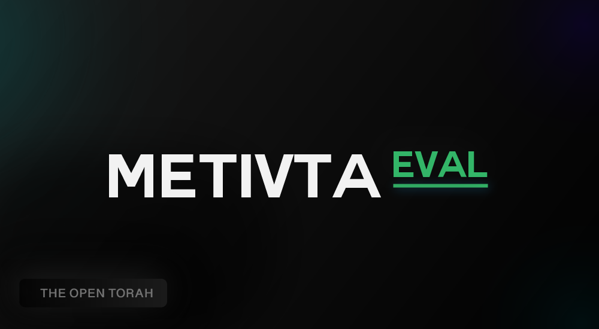
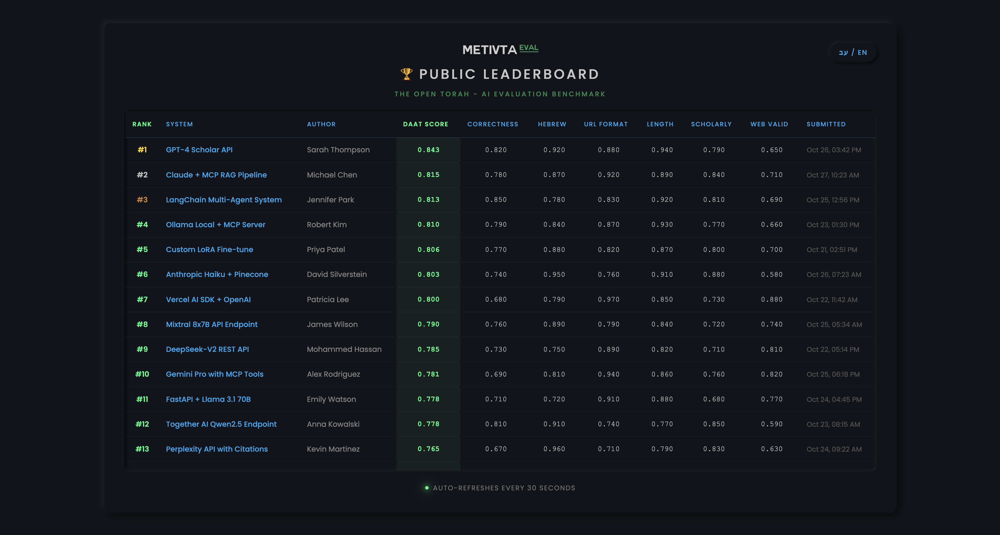
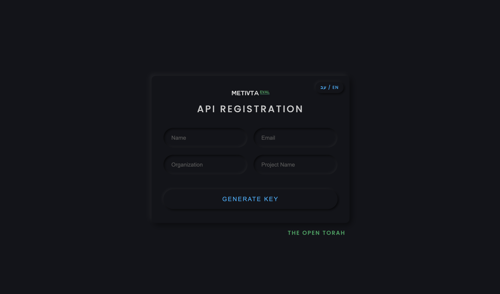
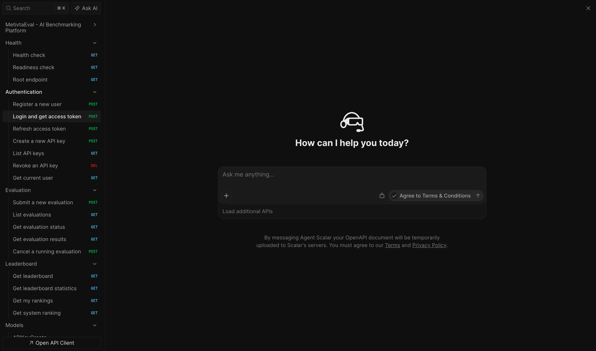

# MetivtaEval

MetivtaEval is an AI benchmarking platform for Torah Q&A and retrieval systems. It combines a
private evaluation toolkit, a deployable API platform, and public leaderboard surfaces for teams
that want to benchmark real systems instead of toy prompts. Under the hood it ships a Go gateway,
FastAPI v2 application, Flask compatibility API, Celery worker, canonical Postgres-backed
persistence, and a seeded Docker demo that proves the stack end-to-end.

This README is intentionally narrow. Every command and workflow below was verified in this
repository before being documented.

## Product Overview

MetivtaEval exists to answer a simple product question: if a team ships a Torah AI system, how do
they measure whether it actually performs well enough to trust in production?

The platform supports two evaluation tracks:

- **DAAT evaluation**
  End-to-end Q&A benchmarking for answer quality, scholarly structure, attribution quality, and
  source-grounded behavior.
- **MTEB-style retrieval evaluation**
  Retrieval benchmarking for ranked passage quality using standard IR metrics such as nDCG, MAP,
  MRR, Recall, and Precision.

The product surface is built around two user journeys:

- **Public benchmarking**
  Teams expose an API endpoint, submit it for evaluation, and compare against a shared leaderboard.
- **Private development**
  Teams inspect the local dataset, run controlled validation, sync optional artifacts to LangSmith,
  and harden integrations before release.

## Why It Is Useful

- It benchmarks a running system, not a handcrafted answer file.
- It keeps a compatibility path for older integrations while exposing a modern FastAPI v2 surface.
- It supports both answer-generation and retrieval-only systems.
- It can run locally with Docker, then scale outward with optional SaaS integrations.

## What It Evaluates

### DAAT mode

DAAT is the Q&A track. You provide an answer endpoint, the platform sends real questions, and the
evaluation stack scores the responses for:

- answer completeness and correctness
- scholarly structure and citation behavior
- attribution quality through the DAAT score
- retrieval-adjacent hygiene such as response format and URL quality
- optional web validation when Browserless is configured

Your system contract for DAAT is a single HTTP endpoint:

```http
POST /answer
Content-Type: application/json

{"question":"..."}
```

Expected response:

```json
{"answer":"..."}
```

The bundled `demo-answer` service was validated against this exact contract in Docker.

### MTEB mode

MTEB is the retrieval track. You provide a retrieval endpoint, the platform sends benchmark
queries, and the evaluator computes standard information retrieval metrics:

- nDCG@10
- MAP@100
- MRR@10
- Recall@100
- Precision@10

Your system contract for MTEB is:

```http
POST /retrieve
Content-Type: application/json

{"query":"...","top_k":100}
```

Verified response shape:

```json
{
  "results": [
    {"id":"passage_001","score":0.9234},
    {"id":"passage_002","score":0.8876}
  ]
}
```

The bundled [reference_retrieval_api.py](./examples/reference_retrieval_api.py)
was started locally and validated through a live MTEB submission against the Docker stack.

## How Teams Use It

1. Expose a system endpoint that matches either the DAAT or MTEB contract.
2. Register through the API, create credentials, and submit the endpoint URL.
3. Let the platform call the system, score the results, and persist them.
4. Review the final evaluation payload or leaderboard ranking.

There are two public leaderboard views in the product:

- **DAAT leaderboard** for end-to-end Q&A systems
- **MTEB leaderboard** for retrieval systems

## Product Preview

The README preview images live in a dedicated folder:

- `docs/assets/readme/previews/leaderboard.png`
- `docs/assets/readme/previews/signup.png`
- `docs/assets/readme/previews/api-reference.png`

### Leaderboard Dashboard

This is the public-facing ranking surface where teams compare live systems, benchmark iterations,
and show progress over time.



### Runtime Signup And API Key Issuance

This screenshot belongs to the runnable stack, not the public `metivta.co` documentation site. It
is the onboarding surface for evaluators and submitters when you launch the full application
locally or self-host it.



### API Reference

This is the operator and integrator surface. It should make the contract legible at a glance:
authentication, evaluation payloads, and leaderboard endpoints.



## How Users Get API Keys

The public `metivta.co` site does not issue API keys. The two supported issuance paths below belong
to the runnable stack you launch locally or self-host.

### Browser flow

For user-facing onboarding inside the runnable stack, the Flask compatibility app serves a
registration page at:

- local Docker demo: [http://localhost:18080/signup](http://localhost:18080/signup)
- self-hosted runtime: `<your-runtime-base-url>/signup`

That page submits to `POST /register` and immediately returns an API key. This path was verified
against the running stack.

The legacy registration payload is:

```json
{
  "email": "team@example.com",
  "name": "Team Name",
  "organization": "Optional Org"
}
```

Verified response shape:

```json
{
  "message": "Registration successful! Save your API key - it won't be shown again.",
  "api_key": "mtv_...",
  "key_prefix": "mtv_..."
}
```

### API-first flow

For modern integrations, users register and then create scoped API keys through FastAPI v2:

1. `POST /api/v2/auth/register`
2. `POST /api/v2/auth/login`
3. `POST /api/v2/auth/api-keys`

This path was also verified end-to-end in the Docker stack.

## What This Repository Proves

- Auth works end-to-end: register, login, refresh, and API-key creation.
- DAAT evaluation works from the local JSON dataset without requiring a pre-created LangSmith
  dataset.
- MTEB evaluation works against a live retrieval endpoint and persists to the retrieval leaderboard.
- Legacy `/submit?async=true` compatibility still works through the worker and status polling path.
- Leaderboards render through both FastAPI JSON APIs and the Flask dashboard.
- Scalar API docs are live at `/api/v2/docs` and open expanded by default.
- Optional LangSmith sync, Anthropic-backed evaluators, and Browserless-backed web validation work
  when credentials are configured.
- Python linting, type checking, pytest, and Go race tests pass in the current repo state.

## Architecture

| Component | Role |
| --- | --- |
| Go gateway | Front door on `:18000`, routes traffic to the application stack |
| FastAPI v2 | Primary API for auth, evaluations, leaderboard APIs, and docs |
| Flask compatibility API | Preserves historical `/submit` and `/status/<task_id>` contracts |
| Celery worker | Executes async evaluation jobs |
| Postgres | Canonical persistence for users, API keys, evaluations, and leaderboard state |
| Redis | Celery broker and result backend |
| Local dataset loader | Loads DAAT examples directly from JSON at runtime |
| LangSmith | Optional dataset sync and tracing, not a mandatory DAAT runtime dependency |

## Hosted Deployment Targets

MetivtaEval supports both managed and self-hosted deployment targets:

- **Azure Container Apps** (verified): production-grade hosted deployment with custom domains and
  managed TLS.
- **Render**: blueprint-based deployment path retained for teams already on Render.
- **Docker Compose**: self-hosted local or VM-based deployment.

For Azure-specific setup and commands, see
[docs/DEPLOYMENT.md](./docs/DEPLOYMENT.md)
and follow the Azure Container Apps section.

### Public docs-only launch mode

If you are launching only a homepage + API reference first, set:

```bash
PUBLIC_DOCS_ONLY=true
```

In this mode:

- `/` and `/api/v2/docs` remain public
- `/api/v2/openapi.json` remains public
- evaluation and auth APIs are intentionally not exposed publicly

The public `metivta.co` host is documentation-only. Signup, API key issuance, leaderboard writes,
and evaluation execution belong to the runtime you launch locally or self-host.

## Verified Quick Start

<details>
<summary><strong>Expand quick start (requirements, local stack, and production checks)</strong></summary>

### Requirements

- Docker with Compose v2
- Python 3.11+
- `uv`
- `jq` for the shell examples
- Go 1.24+ for local Go tests

### 1. Install dependencies

```bash
make setup
```

### 2. Start a local stack

For normal local development, use the unseeded stack:

```bash
make compose-dev
```

For the seeded end-to-end proof path, use the demo stack:

```bash
make compose-demo
```

> **Security Note:** The demo stack reads `METIVTA_DEMO_PASSWORD` for local auth seeding and
> otherwise generates an ephemeral demo credential at runtime. Do not expose a live instance
> configured with the `demo` profile to the public internet.

For live fault-injection verification against Docker, use:

```bash
make compose-faults
```

The stack is ready when `demo-seeder` exits with code `0`:

```bash
docker compose --profile legacy --profile demo ps --all
docker compose --profile legacy --profile demo logs demo-seeder --tail=50
```

`make compose-demo` intentionally caps the dataset to two examples for fast local verification. For a
full local benchmark run with the demo services enabled and no demo cap, start the same stack
without that environment override:

```bash
docker compose --profile legacy --profile demo up -d --build
```

You can also override the benchmark dataset or evaluator profile at launch time without editing
code:

```bash
METIVTA_DATASET_NAME=My-Benchmark \
METIVTA_DATASET_LOCAL_PATH=/app/custom-dataset \
METIVTA_DATASET_FILES_QUESTIONS=questions.json \
METIVTA_EVALUATION_DAAT_EVALUATORS=hebrew_presence,url_format,response_length,daat_score \
docker compose --profile legacy --profile demo up -d --build
```

### 3. Open the live surfaces

- Gateway: [http://localhost:18000](http://localhost:18000)
- Scalar API docs: [http://localhost:18000/api/v2/docs](http://localhost:18000/api/v2/docs)
- OpenAPI JSON: [http://localhost:18000/api/v2/openapi.json](http://localhost:18000/api/v2/openapi.json)
- Dataset info: [http://localhost:18080/dataset-info](http://localhost:18080/dataset-info)
- Runtime signup page: [http://localhost:18080/signup](http://localhost:18080/signup)
- Flask leaderboard: [http://localhost:18080/leaderboard](http://localhost:18080/leaderboard)

### 4. Run the local operator checklist before production

These checks were validated against the running Docker stack:

```bash
curl -fsS http://localhost:18000/ready | jq .
curl -fsS http://localhost:18080/dataset-info | jq .
curl -fsS http://localhost:18080/signup >/dev/null && echo runtime_signup_ok
curl -fsS http://localhost:18080/leaderboard >/dev/null && echo leaderboard_ok
curl -fsS \
  -X POST http://localhost:18080/validate-endpoint \
  -H 'Content-Type: application/json' \
  -d '{"endpoint_url":"http://demo-answer:5001/answer"}' | jq .
```

What each surface is for:

| URL | Purpose |
| --- | --- |
| `http://localhost:18000/ready` | Verify DB, Redis, API, and local DAAT dataset readiness |
| `http://localhost:18000/api/v2/docs` | Verify the public API contract in Scalar |
| `http://localhost:18080/signup` | Verify the runtime API key issuance page |
| `http://localhost:18080/leaderboard` | Verify the browser leaderboard experience |
| `http://localhost:18080/dataset-info` | Verify which dataset file the stack is actually using |
| `http://localhost:18080/validate-endpoint` | Verify a DAAT endpoint matches the harness contract |

</details>

## Verified API Walkthrough

<details>
<summary><strong>Expand DAAT end-to-end API walkthrough</strong></summary>

The following shell flow was executed against the running Docker stack. It creates a user, logs in,
creates an API key, submits a DAAT evaluation, fetches results, and reads the leaderboard.

Important:

- Keep `endpoint_url` set to `http://demo-answer:5001/answer` while the demo stack is running.
- That hostname is resolved from inside the Docker network by the evaluator service, not by your
  local shell.

```bash
BASE_URL=http://localhost:18000
EMAIL="readme-$(date +%s)@example.com"
PASSWORD="${PASSWORD:-replace-with-local-demo-password}"

REGISTER_PAYLOAD=$(jq -n \
  --arg email "$EMAIL" \
  --arg password "$PASSWORD" \
  '{email:$email,name:"README User",password:$password,organization:"README"}')

curl -fsS \
  -X POST "$BASE_URL/api/v2/auth/register" \
  -H 'Content-Type: application/json' \
  -d "$REGISTER_PAYLOAD"

LOGIN_PAYLOAD=$(jq -n \
  --arg email "$EMAIL" \
  --arg password "$PASSWORD" \
  '{email:$email,password:$password}')

ACCESS_TOKEN=$(curl -fsS \
  -X POST "$BASE_URL/api/v2/auth/login" \
  -H 'Content-Type: application/json' \
  -d "$LOGIN_PAYLOAD" | jq -r '.access_token')

curl -fsS \
  -X POST "$BASE_URL/api/v2/auth/api-keys" \
  -H "Authorization: Bearer $ACCESS_TOKEN" \
  -H 'Content-Type: application/json' \
  -d '{"name":"readme-key","scopes":["eval:read","eval:write"]}'

EVAL_ID=$(curl -fsS \
  -X POST "$BASE_URL/api/v2/eval/" \
  -H "Authorization: Bearer $ACCESS_TOKEN" \
  -H 'Content-Type: application/json' \
  -d '{
    "system_name":"README Demo",
    "system_version":"1.0.0",
    "endpoint_url":"http://demo-answer:5001/answer",
    "mode":"daat",
    "dataset_name":"default",
    "async_mode":false
  }' | jq -r '.id')

curl -fsS \
  -H "Authorization: Bearer $ACCESS_TOKEN" \
  "$BASE_URL/api/v2/eval/$EVAL_ID/results"

curl -fsS "$BASE_URL/api/v2/leaderboard/"
```

</details>

## Verified MTEB Walkthrough

<details>
<summary><strong>Expand MTEB retrieval walkthrough</strong></summary>

The retrieval path was also validated end-to-end with the bundled reference retrieval API.

### 1. Start the reference retrieval API

```bash
uv run python examples/reference_retrieval_api.py
```

It exposes:

- `GET /health`
- `POST /retrieve`

### 2. Verify the retrieval API locally

```bash
curl -fsS http://127.0.0.1:5001/health

curl -fsS \
  -X POST http://127.0.0.1:5001/retrieve \
  -H 'Content-Type: application/json' \
  -d '{"query":"What does the Divrei Yoel say about Bereishis?","top_k":3}'
```

### 3. Submit a real MTEB evaluation through the stack

When the Docker stack is running, use `host.docker.internal` so the FastAPI container can reach the
host-side retrieval service:

```bash
BASE_URL=http://localhost:18000
EMAIL="mteb-$(date +%s)@example.com"
PASSWORD="${PASSWORD:-replace-with-local-demo-password}"

REGISTER_PAYLOAD=$(jq -n \
  --arg email "$EMAIL" \
  --arg password "$PASSWORD" \
  '{email:$email,name:"MTEB User",password:$password,organization:"README"}')

curl -fsS \
  -X POST "$BASE_URL/api/v2/auth/register" \
  -H 'Content-Type: application/json' \
  -d "$REGISTER_PAYLOAD"

ACCESS_TOKEN=$(curl -fsS \
  -X POST "$BASE_URL/api/v2/auth/login" \
  -H 'Content-Type: application/json' \
  -d "$(jq -n --arg email "$EMAIL" --arg password "$PASSWORD" '{email:$email,password:$password}')" \
  | jq -r '.access_token')

EVAL_ID=$(curl -fsS \
  -X POST "$BASE_URL/api/v2/eval/" \
  -H "Authorization: Bearer $ACCESS_TOKEN" \
  -H 'Content-Type: application/json' \
  -d '{
    "system_name":"README MTEB Demo",
    "system_version":"1.0.0",
    "endpoint_url":"http://host.docker.internal:5001/retrieve",
    "mode":"mteb",
    "dataset_name":"default",
    "async_mode":false
  }' | jq -r '.id')

curl -fsS \
  -H "Authorization: Bearer $ACCESS_TOKEN" \
  "$BASE_URL/api/v2/eval/$EVAL_ID/results"

curl -fsS "$BASE_URL/api/v2/leaderboard/?mode=mteb"
```

This flow was validated with:

- evaluation id `a53adf9a-8e97-4cf0-832e-2e358f06eb78`
- `ndcg_10=0.8642322944270175`
- `map_100=0.75`
- `mrr_10=0.8666666666666666`

</details>

## Legacy Compatibility API

The repository still ships the original Flask compatibility surface for older clients:

- `GET /signup`
- `POST /register`
- `POST /submit`
- `GET /status/<task_id>`

That path is preserved and validated in the Docker demo through the seeded legacy async submission
flow. New integrations should target `/api/v2/*`.

## Dataset Workflow

MetivtaEval keeps the DAAT dataset local by default. The runtime reads the configured JSON file
directly, which means DAAT does not depend on a remote LangSmith dataset being pre-provisioned.

> **Holdback dataset:** The public holdback file lives at
> `src/metivta_eval/dataset/Q1-holdback.json`. Since centralized result collection is not currently
> being run, use this holdback directly for manual or independent verification.

### Show the public question set

```bash
make show-questions
```

### Export a submission template without prompts

```bash
uv run python -m metivta_eval.scripts.show_questions --export /tmp/metivta-answers.json
```

### Optional: sync the dataset to LangSmith

If `LANGSMITH_API_KEY` or `LANGCHAIN_API_KEY` is configured, this command uploads the local dataset
to the `Metivta-Eval` dataset in LangSmith:

```bash
make dataset-upload
```

## Build Your Own Benchmark

<details>
<summary><strong>Expand benchmark customization guide</strong></summary>

If you want to turn this repository into your own evaluation harness and public leaderboard, start
with [BUILD_YOUR_OWN_BENCHMARK.md](./docs/BUILD_YOUR_OWN_BENCHMARK.md).

The short operator version is:

1. Replace the dataset and rubric files that define the benchmark.
2. Pin the evaluator profile you want in `config.toml`.
3. Launch `make compose-dev` for the normal product surface or `make compose-demo` for the seeded
   proof path, then verify `/ready`, `/signup`, `/leaderboard`, and `/api/v2/docs` in your
   self-hosted runtime.
4. Issue a key, submit real systems by URL, and review the API and browser leaderboard surfaces.

The main control points are:

| Goal | Change here |
| --- | --- |
| Rename the benchmark | `config.toml` -> `[dataset].name` and `[dataset].version` |
| Replace DAAT questions and answers | `config.toml` -> `[dataset.files].questions` |
| Publish a safe question-only template | `config.toml` -> `[dataset.files].questions_only` |
| Replace the scholarly rubric | `config.toml` -> `[dataset.files].format_rubric` |
| Replace the MTEB benchmark | `config.toml` -> `[dataset.mteb]` |
| Switch to a more deterministic DAAT harness | `config.toml` -> `[evaluation.daat].evaluators` |
| Tune DAAT scoring weights | `config.toml` -> `[evaluation.daat.weights]` |
| Disable or tune remote web validation | `config.toml` -> `[evaluation.web_validator]` |
| Change the default local target for script-based evaluation | `config.toml` -> `[evaluation].endpoint_url` |
| Change scoring logic itself | `src/metivta_eval/evaluators/` |

For teams that want a deterministic baseline harness, the verified no-LLM profile is:

```toml
[evaluation.daat]
enabled = true
evaluators = ["hebrew_presence", "url_format", "response_length", "daat_score"]
```

That guide covers:

- local Docker launch and pre-production URL checks
- where users get API keys
- which endpoint URL your users submit for DAAT or MTEB
- how to replace the dataset and rubrics
- how to tune the DAAT evaluator profile in `config.toml`
- how to host your own leaderboard around a custom benchmark

</details>

## Optional External Integrations

<details>
<summary><strong>Expand optional integration setup</strong></summary>

These integrations are supported, but the core Docker demo does not require them to exist ahead of
time:

- `LANGSMITH_API_KEY` or `LANGCHAIN_API_KEY`
  Purpose: optional dataset sync and tracing
- `ANTHROPIC_API_KEY`
  Purpose: LLM-backed evaluator tiers
- `BROWSERLESS_TOKEN`
  Purpose: remote web validation

In the verified Docker run for this repository state:

- LangSmith dataset sync succeeded for `Metivta-Eval`
- Anthropic-backed evaluator metrics were present in the DAAT result
- Browserless-backed web validation metrics were present in the DAAT result

</details>

## Live Surfaces

- API docs: [http://localhost:18000/api/v2/docs](http://localhost:18000/api/v2/docs)
- OpenAPI JSON: [http://localhost:18000/api/v2/openapi.json](http://localhost:18000/api/v2/openapi.json)
- Readiness: [http://localhost:18000/ready](http://localhost:18000/ready)
- Flask leaderboard: [http://localhost:18080/leaderboard](http://localhost:18080/leaderboard)

## Quality Gates

These commands were executed successfully against the current repository state:

```bash
uv run ruff check .
uv run pylint api src tests
uv run mypy src
uv run pytest -q
go test -race ./...
```

## Repository Layout

<details>
<summary><strong>Expand repository layout</strong></summary>

```text
api/
  fastapi_app/     FastAPI v2 application and routers
  workers/         Celery worker entrypoints and tasks
  server.py        Flask compatibility API
cmd/
  metivta-gateway/ Go gateway entrypoint
src/metivta_eval/
  dataset/         DAAT and MTEB datasets
  evaluators/      DAAT and MTEB evaluation logic
  persistence/     Canonical SQLAlchemy models and repository layer
  scripts/         Operational and developer tooling
deploy/
  Dockerfiles and deployment manifests
docker-compose.yml
  Local deployment and seeded demo stack
```

</details>

## Notes For Contributors

- Treat the README as a contract. If a command or workflow changes, verify it and then update the
  documentation.
- Prefer the FastAPI v2 API for new integrations.
- Preserve the Flask compatibility API unless you are intentionally removing a migration path.
- Keep DAAT runtime behavior tied to the local dataset loader unless there is a strong operational
  reason to reintroduce a hard remote dependency.

## License

MIT
